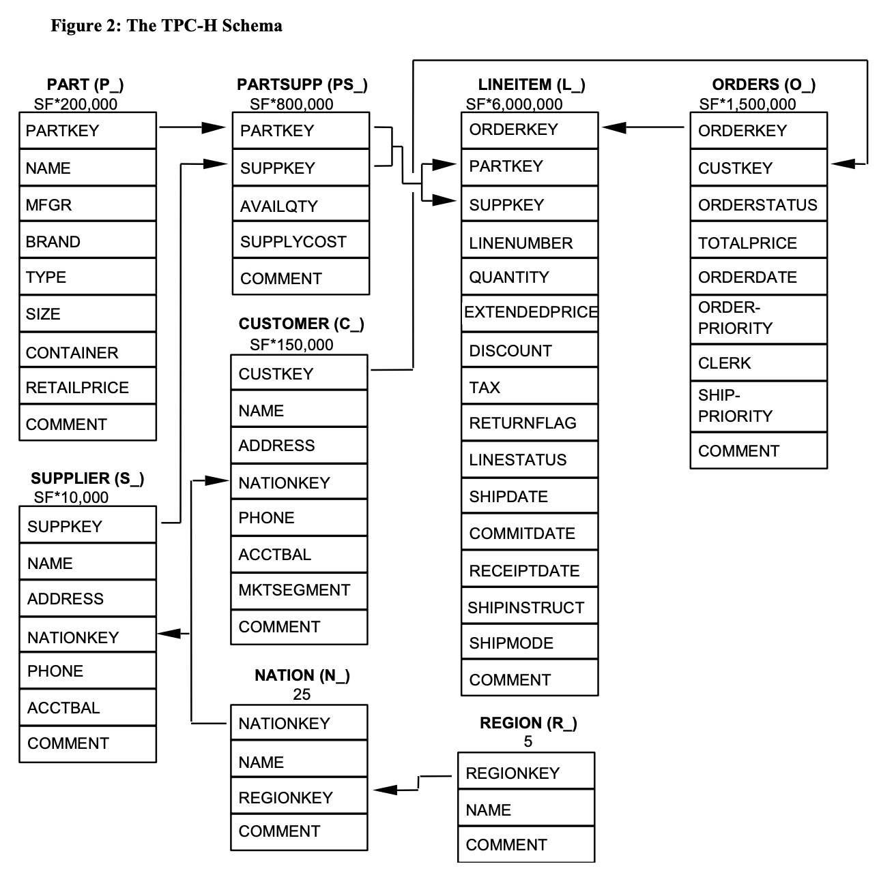

# olap-newbie-training-homework

### 问题描述

给定 TPC-H lineitem 数据表，计算满足 param1 < l_suppkey < param2 条件的的最大l_comment

使用SQL表达，则为：

```
select max(l_comment) from lineitem where l_suppkey > {param1} and l_suppkey <{param2}
```

程序在启动时，需要读入标准 100GB lineitem.tbl 文件，并构建索引或排序，将索引和数据存储在本地磁盘上。
然后读取n组参数（每组为两个整数，param1和param2），然后分别打印每组条件下的最大 comment。

测试样例{实际参数不定}：
输入：
5
100 200
200 2000
5000 6000
2345 6789
123  456

输出：
zzle throughout the
zzle? slyly final platelets sleep quickly.
zzle? slyly final platelets sleep quickly.
zzle? blithely ironi
zzle. special sentiments along

### 生成 100GB lineitem.tbl 文件

使用 [tpch-gen](https://github.com/eyalroz/tpch-dbgen/) 生成 lineitem.tbl 文件，执行如下命令:

```
nohup ./tpch-dbgen/build/dbgen -v -s 100 -b tpch-dbgen/dists.dss </dev/null &>/dev/null &
```

其中 -s 参数为 scale factor(SF) 值，根据该值可估算 TPC-H 所有表的大小，-s 100 即可生成大约 100GB 的数据库，其中 lineitem.tbl 大概 75GB


### 问题分析

首先看一下 TPC-H 的 schema:



由于只需处理 lineitem 的数据，查看 [TPC-H Standard Specification](http://tpc.org/tpc_documents_current_versions/pdf/tpc-h_v3.0.0.pdf) 的描述，lineitem 大约有 SF * 6,000,000 条数据，由于使用了 -s 100 生成数据，可知 lineitem 大概有 6 亿条数据。

再看手册中关于 Lineitem 的表结构说明:

```
Column Name        Datatype Requirements        Comment

L_ORDERKEY         identifier                   Foreign Key to O_ORDERKEY
L_PARTKEY          identifier                   Foreign key to P_PARTKEY, first part of the compound Foreign Key to (PS_PARTKEY,PS_SUPPKEY) with L_SUPPKEY
L_SUPPKEY          identifier                   Foreign key to S_SUPPKEY, second part of the compound Foreign Key to (PS_PARTKEY, PS_SUPPKEY) with L_PARTKEY
L_LINENUMBER       integer
L_QUANTITY         decimal
L_EXTENDEDPRICE    decimal
L_DISCOUNT         decimal
L_TAX              decimal
L_RETURNFLAG       fixed text, size 1
L_LINESTATUS       fixed text, size 1
L_SHIPDATE         date
L_COMMITDATE       date
L_RECEIPTDATE      date
L_SHIPINSTRUCT     fixed text, size 25
L_SHIPMODE         fixed text, size 10
L_COMMENT          variable text size 44

Primary Key: L_ORDERKEY, L_LINENUMBER
```

再看下我们要处理的问题：

```
select max(l_comment) from lineitem where l_suppkey > {param1} and l_suppkey <{param2}
```

上述语句只关心 l_comment 和 l_suppkey，而 l_suppkey 最终来自与 SUPPLIER 这张表：

```
Column Name        Datatype Requirements        Comment
S_SUPPKEY          identifier                   SF*10,000 are populated
S_NAME             fixed text, size 25
S_ADDRESS          variable text, size 40
S_NATIONKEY        identifier                   Foreign Key to N_NATIONKEY
S_PHONE            fixed text, size 15
S_ACCTBAL          decimal
S_COMMENT          variable text, size 101

Primary Key: S_SUPPKEY
```

其数据总量为 SF * 10,000，即 1,000,000 条数据。

返过来再来看 l_comment 字段，数据类型为 `variable text size 44`。由于最后要求的是最大值，因此对于每个 SUPPKEY，只需要根据扫描得到的数据只保存最大值即可。因此在 load 数据阶段，只需要 1,000,000 * (4 + 44) B 数据，不超过 64 MB 数据，而且评测程序不会重启，因此只需要内存就可以了。

### 方案设计

多线程读取文件，使用 concurrent hash map 保存各个键对应的 comment 值，当一个键已经存在与 hash map 中，则通过比较，如果新值比较大，则更新。

读取完之后将 hash map 中的值保存到 map 中，方便后面检索，如果查询次数多还可以将其保存到 vector 中。

### Build & Run

首先使用包管理器安装一些依赖包：

```
apt install -y libiberty-dev
apt install -y libgflags-dev
apt install -y googletest
apt install -y libgoogle-glog-dev
```

先安装一下 [fmt](https://github.com/fmtlib/fmt.git)、[folly](https://github.com/facebook/folly.git)，编译的时候加 CMAKE 参数 `-DCMAKE_BUILD_TYPE=Release -DBUILD_SHARED_LIBS:BOOL=ON -DCMAKE_POSITION_INDEPENDENT_CODE:BOOL=ON`，然后回到本目录，执行:

```
mkdir build && cd build
cmake ..
make -j4
```

执行程序

```
./bin/solutionTest
```
